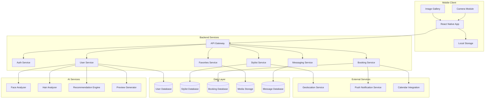
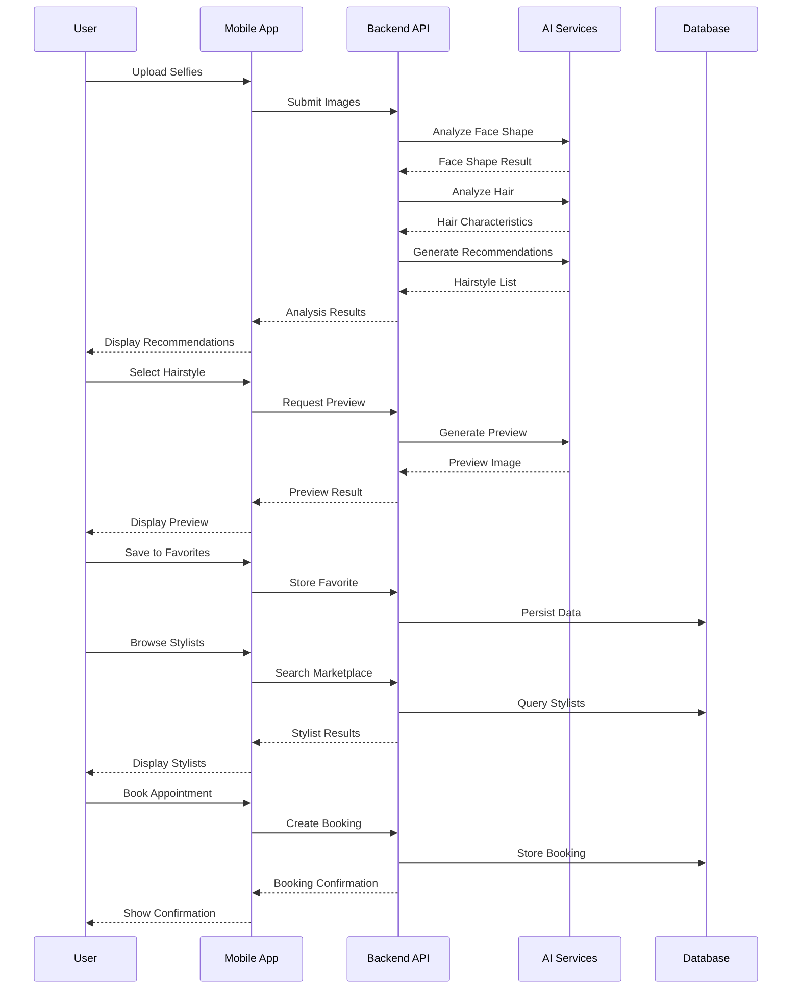

# Design Document: hAIr hero

## Overview

hAIr hero is a mobile application that combines AI-powered facial and hair analysis with a two-sided marketplace connecting users with professional stylists. The system uses open-source AI models for face shape detection, hair characteristic analysis, and identity-preserving hairstyle preview generation. Users receive personalized hairstyle recommendations based on styling rules, can save favorite looks, and book appointments with stylists through an integrated marketplace.

The architecture follows a client-server model with a React Native mobile frontend, a backend API service, and integration with open-source AI models for image processing. The marketplace component enables stylists to create profiles, manage availability, and interact with potential clients.

## Architecture



### System Flow



## Components and Interfaces

### 1. Image Processing Module

Handles selfie upload, validation, and preprocessing.

```typescript
interface ImageProcessor {
  validateImage(image: ImageFile): ValidationResult;
  compressImage(image: ImageFile, maxSizeMB: number): Promise<ImageFile>;
  detectFaces(image: ImageFile): Promise<FaceDetectionResult>;
  preprocessForAnalysis(image: ImageFile): Promise<ProcessedImage>;
}

interface ValidationResult {
  isValid: boolean;
  errors: ValidationError[];
  warnings: string[];
}

interface FaceDetectionResult {
  faceCount: number;
  faces: DetectedFace[];
  primaryFaceIndex: number | null;
}

interface DetectedFace {
  boundingBox: BoundingBox;
  landmarks: FacialLandmarks;
  confidence: number;
}
```

### 2. Face Analyzer

Uses open-source AI (MediaPipe Face Mesh or similar) for face shape classification.

```typescript
interface FaceAnalyzer {
  analyzeFaceShape(image: ProcessedImage): Promise<FaceShapeResult>;
  extractLandmarks(image: ProcessedImage): Promise<FacialLandmarks>;
}

interface FaceShapeResult {
  shape: FaceShape;
  confidence: number;
  landmarks: FacialLandmarks;
  measurements: FaceMeasurements;
}

type FaceShape = 'oval' | 'round' | 'square' | 'heart' | 'oblong' | 'diamond';

interface FaceMeasurements {
  foreheadWidth: number;
  cheekboneWidth: number;
  jawlineWidth: number;
  faceLength: number;
  jawlineAngle: number;
}
```

### 3. Hair Analyzer

Analyzes hair characteristics using image segmentation and classification.

```typescript
interface HairAnalyzer {
  analyzeHair(image: ProcessedImage): Promise<HairAnalysisResult>;
  segmentHairRegion(image: ProcessedImage): Promise<HairSegment>;
}

interface HairAnalysisResult {
  texture: HairTexture;
  thickness: HairThickness;
  currentStyle: string;
  confidence: number;
  hairRegion: HairSegment;
}

type HairTexture = 'straight' | 'wavy' | 'curly' | 'coily';
type HairThickness = 'fine' | 'medium' | 'thick';

interface HairSegment {
  mask: ImageMask;
  boundingBox: BoundingBox;
  coverage: number;
}
```

### 4. Recommendation Engine

Applies styling rules to generate personalized hairstyle recommendations.

```typescript
interface RecommendationEngine {
  generateRecommendations(
    faceShape: FaceShapeResult,
    hairAnalysis: HairAnalysisResult,
    preferences?: UserPreferences
  ): Promise<HairstyleRecommendation[]>;
  
  getCompatibilityScore(
    hairstyle: Hairstyle,
    faceShape: FaceShape,
    hairCharacteristics: HairAnalysisResult
  ): number;
}

interface HairstyleRecommendation {
  hairstyle: Hairstyle;
  compatibilityScore: number;
  reasons: string[];
  referenceImages: string[];
}

interface Hairstyle {
  id: string;
  name: string;
  description: string;
  category: string;
  suitableFaceShapes: FaceShape[];
  suitableTextures: HairTexture[];
  suitableThickness: HairThickness[];
  maintenanceLevel: 'low' | 'medium' | 'high';
  referenceImages: string[];
}
```

### 5. Preview Generator

Generates identity-preserving hairstyle previews using diffusion models.

```typescript
interface PreviewGenerator {
  generatePreview(
    sourceImage: ProcessedImage,
    targetHairstyle: Hairstyle,
    faceData: FaceShapeResult
  ): Promise<PreviewResult>;
}

interface PreviewResult {
  previewImage: ImageFile;
  originalImage: ImageFile;
  hairstyleApplied: Hairstyle;
  generationTime: number;
  success: boolean;
  error?: string;
}
```

### 6. Favorites Manager

Manages user's saved hairstyle looks.

```typescript
interface FavoritesManager {
  saveFavorite(userId: string, favorite: FavoriteData): Promise<Favorite>;
  getFavorites(userId: string): Promise<Favorite[]>;
  getFavoriteById(userId: string, favoriteId: string): Promise<Favorite | null>;
  deleteFavorite(userId: string, favoriteId: string): Promise<boolean>;
  generateShareableLink(favoriteId: string): Promise<string>;
}

interface Favorite {
  id: string;
  userId: string;
  previewImageUrl: string;
  originalImageUrl: string;
  hairstyle: Hairstyle;
  savedAt: Date;
  notes?: string;
}

interface FavoriteData {
  previewImage: ImageFile;
  originalImage: ImageFile;
  hairstyle: Hairstyle;
  notes?: string;
}
```

### 7. Stylist Service

Manages stylist profiles and marketplace presence.

```typescript
interface StylistService {
  registerStylist(data: StylistRegistration): Promise<StylistProfile>;
  updateProfile(stylistId: string, updates: Partial<StylistProfile>): Promise<StylistProfile>;
  addPortfolioImage(stylistId: string, image: ImageFile): Promise<PortfolioItem>;
  removePortfolioImage(stylistId: string, imageId: string): Promise<boolean>;
  setServices(stylistId: string, services: Service[]): Promise<Service[]>;
  setAvailability(stylistId: string, availability: Availability): Promise<Availability>;
  getProfile(stylistId: string): Promise<StylistProfile>;
}

interface StylistProfile {
  id: string;
  userId: string;
  businessName: string;
  bio: string;
  profileImageUrl: string;
  location: Location;
  portfolio: PortfolioItem[];
  services: Service[];
  specialties: string[];
  availability: Availability;
  rating: number;
  reviewCount: number;
  completedBookings: number;
  createdAt: Date;
}

interface Service {
  id: string;
  name: string;
  description: string;
  price: number;
  duration: number; // minutes
  hairstyleCategories: string[];
}

interface Availability {
  weeklySchedule: WeeklySchedule;
  blockedDates: Date[];
  bookingLeadTime: number; // hours
}

interface WeeklySchedule {
  [day: string]: TimeSlot[];
}

interface TimeSlot {
  start: string; // HH:mm format
  end: string;
}
```

### 8. Discovery Service

Enables marketplace search and browsing.

```typescript
interface DiscoveryService {
  searchStylists(query: StylistSearchQuery): Promise<StylistSearchResult>;
  getStylistsByLocation(location: Location, radiusKm: number): Promise<StylistProfile[]>;
  getStylistsBySpecialty(specialty: string, location?: Location): Promise<StylistProfile[]>;
  getRecommendedStylists(userId: string, hairstyleId?: string): Promise<StylistProfile[]>;
}

interface StylistSearchQuery {
  location?: Location;
  radiusKm?: number;
  hairstyleName?: string;
  minRating?: number;
  maxPrice?: number;
  availability?: DateRange;
  sortBy: 'distance' | 'rating' | 'price' | 'relevance';
  page: number;
  pageSize: number;
}

interface StylistSearchResult {
  stylists: StylistProfile[];
  totalCount: number;
  page: number;
  pageSize: number;
}
```

### 9. Booking Service

Manages appointment scheduling.

```typescript
interface BookingService {
  getAvailableSlots(stylistId: string, date: Date): Promise<TimeSlot[]>;
  createBooking(booking: BookingRequest): Promise<Booking>;
  confirmBooking(bookingId: string, stylistId: string): Promise<Booking>;
  cancelBooking(bookingId: string, cancelledBy: string, reason?: string): Promise<Booking>;
  getBookingsByUser(userId: string): Promise<Booking[]>;
  getBookingsByStylist(stylistId: string): Promise<Booking[]>;
  getBookingById(bookingId: string): Promise<Booking | null>;
}

interface BookingRequest {
  userId: string;
  stylistId: string;
  serviceId: string;
  requestedSlot: TimeSlot;
  date: Date;
  hairstyleReferenceId?: string;
  notes?: string;
}

interface Booking {
  id: string;
  userId: string;
  stylistId: string;
  service: Service;
  scheduledDate: Date;
  scheduledTime: TimeSlot;
  status: BookingStatus;
  hairstyleReference?: Favorite;
  notes?: string;
  createdAt: Date;
  confirmedAt?: Date;
  cancelledAt?: Date;
  cancelledBy?: string;
  cancellationReason?: string;
}

type BookingStatus = 'pending' | 'confirmed' | 'cancelled' | 'completed';
```

### 10. Messaging Service

Enables communication between users and stylists.

```typescript
interface MessagingService {
  createConversation(userId: string, stylistId: string): Promise<Conversation>;
  getConversation(conversationId: string): Promise<Conversation>;
  getConversationsByUser(userId: string): Promise<Conversation[]>;
  getConversationsByStylist(stylistId: string): Promise<Conversation[]>;
  sendMessage(conversationId: string, message: MessageInput): Promise<Message>;
  getMessages(conversationId: string, pagination: Pagination): Promise<Message[]>;
  markAsRead(conversationId: string, userId: string): Promise<void>;
}

interface Conversation {
  id: string;
  userId: string;
  stylistId: string;
  bookingId?: string;
  lastMessage?: Message;
  unreadCount: number;
  createdAt: Date;
  updatedAt: Date;
}

interface Message {
  id: string;
  conversationId: string;
  senderId: string;
  senderType: 'user' | 'stylist';
  content: string;
  imageUrl?: string;
  hairstyleReferenceId?: string;
  readAt?: Date;
  createdAt: Date;
}

interface MessageInput {
  senderId: string;
  senderType: 'user' | 'stylist';
  content: string;
  imageFile?: ImageFile;
  hairstyleReferenceId?: string;
}
```

## Data Models

### User Data Model

```typescript
interface User {
  id: string;
  email: string;
  name: string;
  profileImageUrl?: string;
  faceAnalysis?: FaceShapeResult;
  hairAnalysis?: HairAnalysisResult;
  preferences: UserPreferences;
  location?: Location;
  createdAt: Date;
  updatedAt: Date;
}

interface UserPreferences {
  preferredStyles: string[];
  avoidStyles: string[];
  maintenancePreference: 'low' | 'medium' | 'high';
  notificationsEnabled: boolean;
}
```

### Location Data Model

```typescript
interface Location {
  latitude: number;
  longitude: number;
  address?: string;
  city?: string;
  state?: string;
  country?: string;
  postalCode?: string;
}
```

### Review Data Model

```typescript
interface Review {
  id: string;
  bookingId: string;
  userId: string;
  stylistId: string;
  rating: number; // 1-5
  comment?: string;
  createdAt: Date;
}
```

### Hairstyle Database Schema

```typescript
interface HairstyleDatabase {
  hairstyles: Hairstyle[];
  stylingRules: StylingRule[];
}

interface StylingRule {
  id: string;
  faceShape: FaceShape;
  recommendedCategories: string[];
  avoidCategories: string[];
  tips: string[];
}
```


## Correctness Properties

*A property is a characteristic or behavior that should hold true across all valid executions of a system—essentially, a formal statement about what the system should do. Properties serve as the bridge between human-readable specifications and machine-verifiable correctness guarantees.*

### Property 1: Image Format Validation

*For any* uploaded image file, the Selfie_Upload_Handler SHALL accept the file if and only if its format is JPEG, PNG, or HEIC.

**Validates: Requirements 1.1**

### Property 2: Face Detection Validation

*For any* uploaded image, if the Face_Validator detects zero faces, the image SHALL be rejected; if it detects exactly one face, the image SHALL be accepted; if it detects multiple faces, the system SHALL prompt for selection.

**Validates: Requirements 1.3, 1.4**

### Property 3: Image Compression Threshold

*For any* uploaded image exceeding 10MB, the Image_Processor SHALL compress the image to a size at or below 10MB while maintaining the image dimensions sufficient for analysis.

**Validates: Requirements 1.6**

### Property 4: Upload Count Bounds

*For any* upload session, the Selfie_Upload_Handler SHALL accept between 1 and 5 valid images inclusive, rejecting attempts to upload 0 or more than 5 images.

**Validates: Requirements 1.5**

### Property 5: Face Shape Classification Validity

*For any* valid face image processed by the Face_Analyzer, the returned face shape SHALL be exactly one of: oval, round, square, heart, oblong, or diamond.

**Validates: Requirements 2.2**

### Property 6: Confidence Score Range

*For any* face shape classification result, the confidence score SHALL be a number between 0 and 100 inclusive.

**Validates: Requirements 2.3**

### Property 7: Low Confidence Handling

*For any* face shape classification with confidence below 70%, the system SHALL request additional selfies from the user.

**Validates: Requirements 2.4**

### Property 8: Hair Analysis Output Validity

*For any* valid hair analysis result, the texture SHALL be one of (straight, wavy, curly, coily) AND the thickness SHALL be one of (fine, medium, thick).

**Validates: Requirements 3.2, 3.3**

### Property 9: Recommendation Compatibility

*For any* generated hairstyle recommendation, the hairstyle's suitableFaceShapes SHALL include the user's detected face shape, AND the hairstyle's suitableTextures SHALL include the user's hair texture, AND the hairstyle's suitableThickness SHALL include the user's hair thickness.

**Validates: Requirements 4.2, 4.3, 4.4**

### Property 10: Minimum Recommendation Count

*For any* valid face shape and hair characteristics combination, the Recommendation_Engine SHALL return at least 5 compatible hairstyle recommendations.

**Validates: Requirements 4.5**

### Property 11: Recommendation Data Completeness

*For any* hairstyle recommendation returned, the recommendation SHALL include a non-empty name, description, and at least one reference image URL.

**Validates: Requirements 4.6**

### Property 12: Preview Identity Preservation

*For any* generated preview image, the facial landmarks (eyes, nose, mouth positions) SHALL remain within a 5% deviation from the original image's facial landmarks.

**Validates: Requirements 5.2, 5.3**

### Property 13: Favorites Round-Trip Persistence

*For any* favorite saved by a user, retrieving the user's favorites SHALL return a list containing that favorite with identical hairstyle details and preview image URL.

**Validates: Requirements 6.1, 6.2, 6.7**

### Property 14: Favorite Deletion Completeness

*For any* deleted favorite, subsequent retrieval of the user's favorites SHALL NOT include the deleted favorite.

**Validates: Requirements 6.5**

### Property 15: Favorite Data Completeness

*For any* retrieved favorite, the data SHALL include a non-null hairstyle name, save date, and preview image URL.

**Validates: Requirements 6.3**

### Property 16: Stylist Profile Completeness

*For any* registered stylist, retrieving their profile SHALL return all configured fields including business name, location, services, and availability.

**Validates: Requirements 7.1, 7.2, 7.3, 7.4**

### Property 17: Stylist Rating Accuracy

*For any* stylist profile, the displayed rating SHALL equal the average of all review ratings for that stylist, and the review count SHALL equal the total number of reviews.

**Validates: Requirements 7.9**

### Property 18: Location-Based Search Radius

*For any* stylist search with a location and radius, all returned stylists SHALL have a location within the specified radius from the search location.

**Validates: Requirements 8.2**

### Property 19: Specialty Search Accuracy

*For any* search by hairstyle name, all returned stylists SHALL have that hairstyle (or its category) listed in their specialties.

**Validates: Requirements 8.4**

### Property 20: Search Filter Compliance

*For any* filtered search, all returned stylists SHALL satisfy all applied filter criteria (minimum rating, maximum price, distance, availability).

**Validates: Requirements 8.5**

### Property 21: Stylist Listing Data Completeness

*For any* stylist in search results, the listing SHALL include profile photo URL, name, rating, distance, price range, and specialties.

**Validates: Requirements 8.3**

### Property 22: Booking Slot Availability Consistency

*For any* available time slot displayed to a user, the slot SHALL exist in the stylist's configured availability AND NOT be already booked.

**Validates: Requirements 9.1**

### Property 23: Slot Reservation Exclusivity

*For any* reserved time slot, no other user SHALL be able to reserve the same slot for the same stylist until the reservation expires or is cancelled.

**Validates: Requirements 9.2**

### Property 24: Booking Hairstyle Reference Inclusion

*For any* confirmed booking with a hairstyle reference, the booking record SHALL include the hairstyle reference ID and the stylist SHALL be able to view the associated preview image.

**Validates: Requirements 9.3, 7.6**

### Property 25: Cancellation Slot Release

*For any* cancelled booking, the previously reserved time slot SHALL become available for new bookings.

**Validates: Requirements 9.6**

### Property 26: Conversation Creation Correctness

*For any* initiated conversation, the created thread SHALL have exactly two participants: the initiating user and the target stylist.

**Validates: Requirements 10.1**

### Property 27: Message Delivery Completeness

*For any* sent message, the message SHALL be retrievable in the conversation history with correct sender, content, and timestamp.

**Validates: Requirements 10.2, 10.4**

### Property 28: Booking-Conversation Association

*For any* created booking, a conversation thread SHALL exist linking the booking's user and stylist.

**Validates: Requirements 10.5**

### Property 29: Message Persistence

*For any* conversation, all messages SHALL persist across app sessions and be retrievable in chronological order.

**Validates: Requirements 10.6**

## Error Handling

### Image Processing Errors

| Error Condition | Response | User Message |
|----------------|----------|--------------|
| Invalid image format | Reject upload | "Please upload a JPEG, PNG, or HEIC image" |
| No face detected | Reject image | "No face detected. Please upload a clearer photo of your face" |
| Multiple faces detected | Prompt selection | "Multiple faces detected. Please select the primary face or upload a single-face photo" |
| Image too large after compression | Reject upload | "Image is too large. Please upload a smaller image" |
| Face analysis failure | Retry with fallback | "Unable to analyze face shape. Please try with a different photo" |
| Hair analysis failure | Allow manual input | "Unable to detect hair characteristics. Please select your hair type manually" |

### Preview Generation Errors

| Error Condition | Response | User Message |
|----------------|----------|--------------|
| Generation timeout (>30s) | Cancel and retry | "Preview generation is taking too long. Please try again" |
| Model inference failure | Offer alternative | "Unable to generate preview. Try a different hairstyle or source image" |
| Insufficient face quality | Request better image | "Image quality insufficient for preview. Please upload a higher resolution photo" |

### Marketplace Errors

| Error Condition | Response | User Message |
|----------------|----------|--------------|
| Location unavailable | Fallback to manual | "Unable to detect location. Please enter your address manually" |
| No stylists found | Expand search | "No stylists found nearby. Try expanding your search radius" |
| Stylist unavailable | Show alternatives | "This stylist has no available slots. View similar stylists?" |
| Booking conflict | Refresh slots | "This slot is no longer available. Please select another time" |
| Payment failure | Retry option | "Payment could not be processed. Please try again or use a different method" |

### Messaging Errors

| Error Condition | Response | User Message |
|----------------|----------|--------------|
| Message send failure | Retry with backoff | "Message could not be sent. Retrying..." |
| Image upload failure | Offer retry | "Image could not be uploaded. Please try again" |
| Conversation load failure | Show cached | "Unable to load messages. Showing cached conversation" |

## Testing Strategy

### Unit Testing

Unit tests focus on specific examples, edge cases, and error conditions:

- **Image Processor**: Test format validation for each supported format, boundary cases for file size compression
- **Face Analyzer**: Test landmark detection accuracy, face shape classification for known examples
- **Hair Analyzer**: Test texture and thickness classification for representative samples
- **Recommendation Engine**: Test rule application for each face shape, edge cases with limited compatible styles
- **Favorites Manager**: Test CRUD operations, empty state handling
- **Booking Service**: Test slot calculation, conflict detection, cancellation flows
- **Messaging Service**: Test message ordering, read receipt updates

### Property-Based Testing

Property-based tests verify universal properties across randomized inputs. Each property test must run a minimum of 100 iterations.

**Testing Framework**: Use fast-check (TypeScript) for property-based testing.

**Property Test Implementation**:

Each correctness property from the design document must be implemented as a property-based test with the following annotation format:

```typescript
// Feature: hAIr-hero, Property 1: Image Format Validation
test.prop([fc.string()], (filename) => {
  // Test implementation
});
```

**Key Property Tests**:

1. **Image Validation Properties** (Properties 1-4)
   - Generate random file extensions and verify acceptance/rejection
   - Generate random file sizes and verify compression behavior
   - Generate random face counts and verify handling

2. **Analysis Output Properties** (Properties 5-8)
   - Generate random valid images and verify output enum validity
   - Generate random confidence scores and verify threshold behavior

3. **Recommendation Properties** (Properties 9-11)
   - Generate random face shapes and hair characteristics
   - Verify all recommendations satisfy compatibility rules
   - Verify minimum count is always met

4. **Favorites Properties** (Properties 13-15)
   - Generate random favorites and verify round-trip persistence
   - Generate random deletion sequences and verify completeness

5. **Search Properties** (Properties 18-21)
   - Generate random locations and radii, verify distance constraints
   - Generate random filters and verify all results comply

6. **Booking Properties** (Properties 22-25)
   - Generate random booking sequences and verify slot exclusivity
   - Generate random cancellations and verify slot release

7. **Messaging Properties** (Properties 26-29)
   - Generate random message sequences and verify ordering
   - Generate random conversations and verify persistence

### Integration Testing

- **End-to-end analysis flow**: Upload → Face Analysis → Hair Analysis → Recommendations → Preview
- **Booking flow**: Search → Select Stylist → Book → Confirm → Complete
- **Messaging flow**: Initiate → Send Messages → Share Images → View History

### Test Data Generation

For property-based tests, implement generators for:

- `ImageFile`: Random valid images with configurable face count, size, format
- `FaceShape`: Random selection from valid enum values
- `HairCharacteristics`: Random texture and thickness combinations
- `StylistProfile`: Random profiles with valid services and availability
- `Location`: Random coordinates within valid ranges
- `TimeSlot`: Random valid time ranges
- `Booking`: Random bookings with valid slot and service combinations
